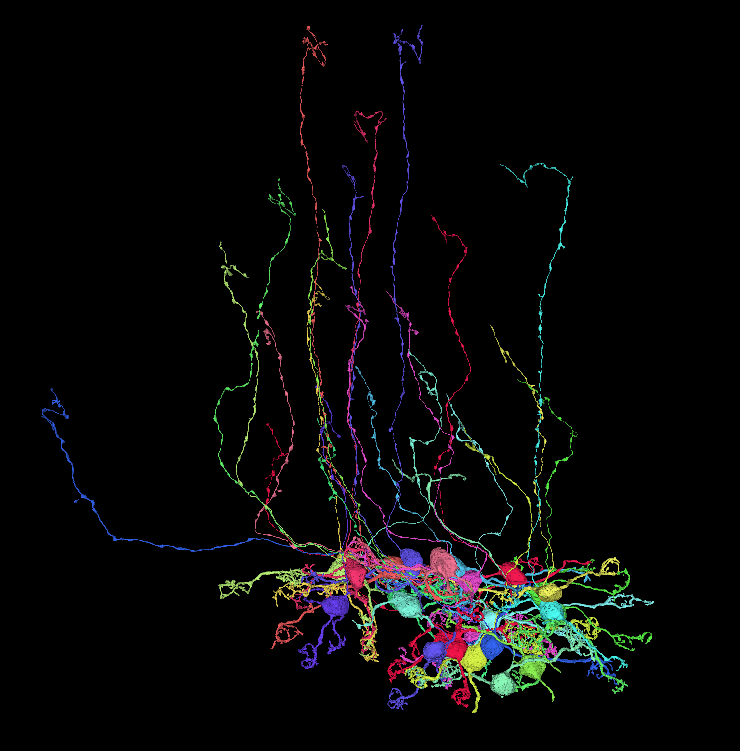
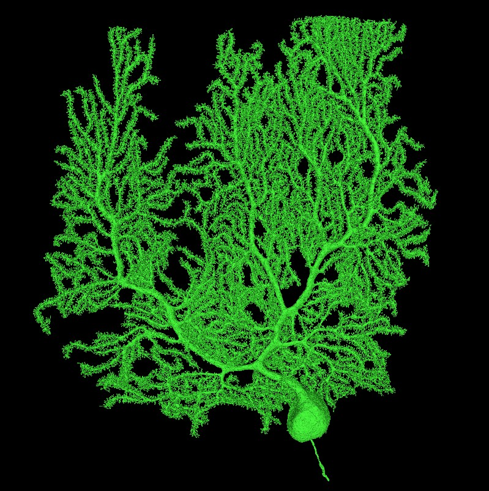

## Example reconstructions

These are mesh renderings that have been exported (as lists of segments) from our proofreading platform's database (MDSeg).
Unfortunately at this point the infrastructure is not yet capable of allowing randomly accessing neurons, though this may be added in the future.

### Granule cells
* Two adjacent granule cells: [viewer](http://catmaid2.hms.harvard.edu:33401/v/two_grcs/)
* A few granule cells: [viewer](http://catmaid2.hms.harvard.edu:33401/v/grcs0/)

### Purkinje cells
**WARNING: These neurons are huge. Make sure you have free RAM (4GB+) before loading.**
* "purkinje_0" cell: [viewer](http://catmaid2.hms.harvard.edu:33401/v/purkinje_0/)
* "pc_9" cell: [viewer](http://catmaid2.hms.harvard.edu:33401/v/pc_9/)
* "pc_15" cell: [viewer](http://catmaid2.hms.harvard.edu:33401/v/pc_15/)
